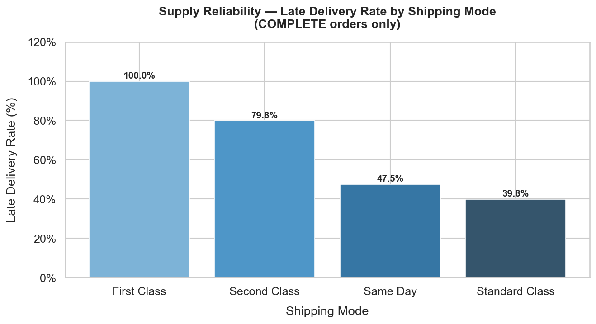
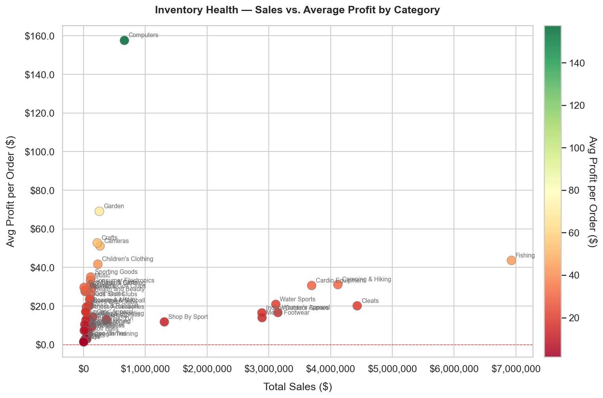
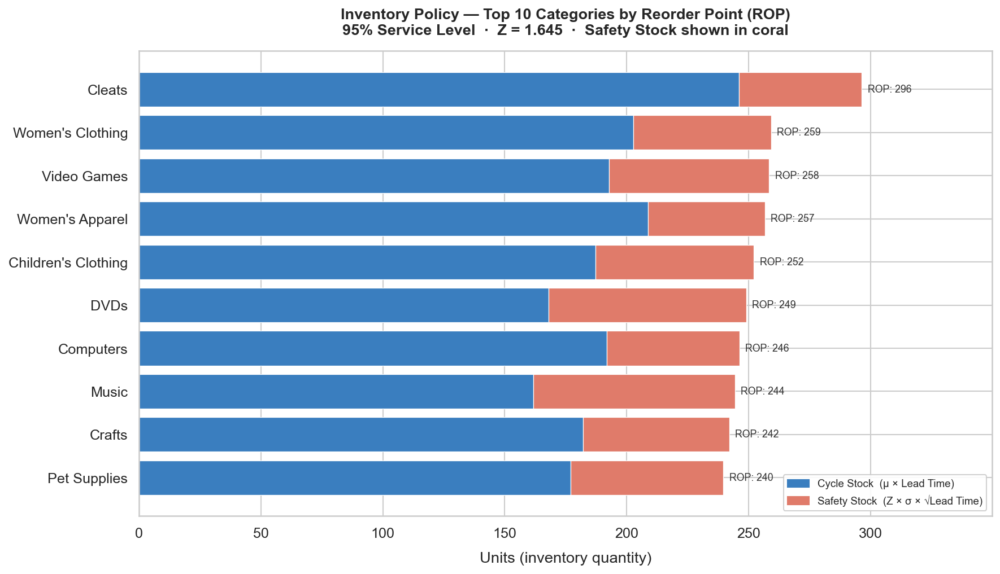

# End-to-End Supply Chain Intelligence: Inventory Optimization & Risk Mitigation
### Transforming Raw ERP Data into Actionable Inventory Policies through Descriptive & Prescriptive Analytics

[](https://www.python.org/)
[](https://www.mysql.com/)
[](https://pandas.pydata.org/)
[](https://seaborn.pydata.org/)
[](https://www.sqlalchemy.org/)
[](https://supply-demand-intelligence-system.streamlit.app/)

---

## Summary

This system applies **Descriptive and Prescriptive Analytics** to 180,519 real-world supply chain records, addressing two core operational challenges that directly impact a company's bottom line: **Demand Uncertainty** and **Supply Reliability**.

Rather than producing reports for their own sake, each analytical layer feeds a decision: demand volatility analysis drives replenishment strategy selection; supply reliability metrics determine safety stock uplift requirements; the inventory health matrix flags working capital inefficiencies. The output is not a dashboard — it is a set of **inventory policy recommendations** that procurement and operations teams can act on immediately.

**Primary Objective:** Minimize stockout risk while optimizing working capital deployment across the product portfolio.

---

## Core Methodology

### Analytical Framework

The system operates in two analytical modes:

- **Descriptive Analytics (Phase 1):** Quantifies the current state — how volatile is demand? How unreliable is supply? Where is margin being destroyed? These questions produce the risk baseline.
- **Prescriptive Analytics (Phase 2):** Translates that baseline into policy — given measured demand variability and observed lead times, what should the Safety Stock and Reorder Point be for each SKU category?

### Inventory Policy Model

The system implements a **continuous review inventory policy** with statistically derived safety stock targets. The core formula applied in Phase 2 is the **combined-variance model** (Nahmias & Olsen), which accounts for both demand uncertainty and lead-time uncertainty simultaneously:

$$Safety\ Stock = Z \times \sqrt{\sigma^2_{demand} \times \mu_{LT} \ + \ \mu^2_{demand} \times \sigma^2_{LT}}$$

| Parameter | Value | Rationale |
|---|---|---|
| $Z$ | **1.645** | Targets a **95% Service Level** — the optimal balance between stockout risk and excess carrying cost for a mid-volatility portfolio |
| $\sigma_{demand}$ | Per-category daily demand standard deviation, derived from historical order data | |
| $\mu_{LT}$ | Average actual lead time (days) per category | |
| $\sigma_{LT}$ | Standard deviation of actual lead time per category — captures supplier unreliability |

> **Why not the simpler formula $Z \times \sigma_{demand} \times \sqrt{\mu_{LT}}$?** That formula assumes lead time is deterministic. This dataset has a **79.8% late delivery rate** for Second Class shipping, meaning $\sigma_{LT}$ is material. Ignoring it systematically underestimates safety stock for categories routed through unreliable carriers. The combined-variance model reduces exactly to the simple formula when $\sigma_{LT} = 0$.

The **Reorder Point (ROP)** is then calculated as:

$$ROP = \mu_{demand} \times \mu_{LT} + Safety\ Stock$$

Where $\mu_{demand}$ is average daily demand and $\mu_{LT}$ is the average lead time in days. This gives procurement teams a precise trigger point to initiate replenishment before a stockout occurs.

---

## Tech Stack

| Layer | Technology | Role |
|---|---|---|
| Data Engineering | SQL · MySQL 8.0 | ETL, KPI aggregations, CTEs, window functions |
| Statistical Modeling | Python · Pandas · NumPy | Demand variability analysis, safety stock calculations, ROP engine |
| Visualization | Matplotlib · Seaborn | Automated BI dashboard generation |
| ORM / DB Interface | SQLAlchemy | Parameterized queries, connection management |
| Dataset | DataCo Smart Supply Chain — 180,519 rows | Source of all transactional demand and logistics data |

---

## System Architecture

```
Raw ERP / CSV Export (180K+ order records)
              │
              ▼
  ┌───────────────────────┐
  │    ingest_data.py     │  ← Standardizes column schema, handles encoding,
  │    (ETL Pipeline)     │    bulk-loads into relational store via SQLAlchemy
  └───────────────────────┘
              │
              ▼
  ┌───────────────────────┐
  │   MySQL Database      │  ← supply_chain_db.orders
  │   (supply_chain_db)   │    Denormalized fact table — single source of truth
  └───────────────────────┘
              │
        ┌─────┴──────┐
        ▼            ▼
  ┌──────────┐  ┌─────────────────────────┐
  │ sql/     │  │   visualize_insights.py │  ← Executes KPI queries (Charts 01–03),
  │ *.sql    │  │   (BI Dashboard Engine) │    exports demand/reliability/health charts
  └──────────┘  └─────────────────────────┘
                            │
                            ▼
              ┌──────────────────────────────┐
              │   inventory_optimization.py  │  ← Computes Safety Stock & ROP per
              │   (Inventory Policy Engine)  │    category · Chart 04 stacked bar
              └──────────────────────────────┘
                            │
                            ▼
              ┌─────────────────────────┐
              │      assets/*.png       │  ← 01 Demand Volatility
              │   (Committed Outputs)   │    02 Supply Reliability
              │                         │    03 Inventory Health
              │                         │    04 ROP Recommendations
              └─────────────────────────┘
```

---

## Strategic Insights — Dashboard Analysis

### 01 — Demand Volatility: Replenishment Strategy Segmentation


**Executive Summary:**
The Coefficient of Variation ($CV = \sigma / \mu$) is the primary metric for segmenting the product portfolio into replenishment strategies. A high CV indicates that average demand is a poor predictor of future demand — meaning any inventory policy built on simple averages will routinely result in either excess stock or stockouts.

This analysis reveals a clear bifurcation in the portfolio. **Cameras** emerge as the highest-risk category with a CV of **~0.94**, indicating that monthly sales volume is nearly as volatile as the average itself. Categories with $CV > 0.5$ — including Cardio Equipment and Lacrosse — should be migrated away from **Just-in-Time (JIT)** replenishment toward **Buffer Stocking** strategies with elevated safety stock targets. Conversely, low-CV categories are candidates for leaner JIT policies that reduce holding costs without materially increasing stockout risk. This segmentation directly informs the $\sigma_{demand}$ inputs to the Safety Stock formula.

---

### 02 — Supply Reliability: Lead Time Risk & Safety Stock Uplift



**Executive Summary:**
Supply reliability is the second variable in the Safety Stock equation — and this analysis uncovers a critical vulnerability. **Second Class shipping carries a 79.8% late delivery rate** across all completed orders, meaning that for nearly four in five shipments, actual transit time exceeded the scheduled lead time used in procurement planning.

This has a direct and computable impact on inventory policy. The system's safety stock engine uses the **combined-variance formula**, which incorporates $\sigma_{LT}$ (lead-time standard deviation) per category alongside demand variance — so the 79.8% late-delivery rate is captured in the calculation rather than ignored. Categories routed through Second Class automatically receive higher safety stock targets reflecting their supplier's actual unreliability. Operationally, this finding also warrants one of two strategic responses: **carrier SLA renegotiation** with updated lead time commitments, or a **modal shift** for high-velocity, high-volatility SKUs to a more reliable shipping tier. Either path reduces $\sigma_{LT}$, directly lowering the safety stock required to hold the 95% service level.

---

### 03 — Inventory Health: Working Capital Efficiency Matrix



**Executive Summary:**
The Sales vs. Profitability scatter matrix surfaces the working capital efficiency profile of every product category simultaneously. The analytical framework maps categories into four strategic quadrants: high-sales/high-margin (core portfolio), high-sales/low-margin (volume traps), low-sales/high-margin (niche value), and low-sales/low-margin (candidates for rationalization).

Categories appearing **at or below the zero-profit line** (red dashed) represent active working capital drains — they consume inventory investment, occupy warehouse space, and generate order fulfillment cost, while returning negligible or negative margin. For a supply chain analyst, these are the first candidates for **SKU rationalization**: reducing order frequency, increasing minimum order quantities, or delisting. Freeing the capital tied to these slow-movers can be redeployed into safety stock for high-CV, high-margin categories where a stockout carries real revenue consequence.

---

### 04 — Reorder Point (ROP) Recommendations



**Executive Summary:**
This stacked bar chart is the direct output of the inventory policy engine (`inventory_optimization.py`). Each bar represents the total Reorder Point for a category, decomposed into two distinct components: the **Cycle Stock** (steel blue) — units consumed during a normal replenishment lead time — and the **Safety Stock** (coral) — the statistical buffer required to maintain a 95% service level against demand variability and lead time uncertainty.

The coral portion is the key decision variable. A wider coral bar indicates a category where demand volatility or unreliable lead times are forcing procurement to hold a larger risk buffer, tying up working capital. Categories with disproportionately large safety stock relative to cycle stock are immediate candidates for supplier lead time negotiation or demand stabilization initiatives. The chart translates the abstract formulas of the inventory policy into a visual that any procurement manager can act on directly: when on-hand stock hits the ROP line, it is time to order.

---

## Business Value

| Risk | Before This System | After This System |
|---|---|---|
| **Stockout Risk** | Undifferentiated reorder points based on simple averages | CV-segmented safety stock targets — high-volatility categories carry statistically sufficient buffer |
| **Lead Time Exposure** | Planned lead times used as-is in inventory calculations | Actual lead time variance quantified; safety stock uplifted accordingly for unreliable shipping modes |
| **Working Capital Waste** | No systematic view of margin vs. sales across categories | Low-margin, low-velocity SKUs identified for rationalization; capital redeployed to core portfolio |
| **Inventory Turnover** | Static replenishment cycles across all categories | Differentiated policies (JIT vs. Buffer Stocking) aligned to demand profile, improving turnover on stable SKUs |

---

## Project Structure

```
Supply-Demand-Analytics/
├── data/
│   └── raw/                              # Source CSV (not tracked in git)
├── assets/                               # Committed chart images (rendered in README)
│   ├── 01_demand_volatility.png          # CV-based replenishment segmentation
│   ├── 02_supply_reliability.png         # Late delivery rate by shipping mode
│   ├── 03_inventory_health.png           # Sales vs. margin working capital matrix
│   ├── 04_inventory_recommendations.png  # ROP stacked bar — cycle + safety stock
│   ├── 05_demand_forecast.png            # 90-day Prophet forecast with CI
│   └── 06_seasonality_analysis.png       # Weekly & yearly seasonality components
├── dashboards/                           # Local script outputs (not tracked in git)
│   └── inventory_policy.csv             # Full ROP & safety stock table (all categories)
├── sql/
│   ├── 01_demand_volatility.sql          # Reference queries
│   └── 02_supply_reliability.sql
├── logs/                                 # Ingestion logs (not tracked in git)
├── notebooks/                            # Exploratory analysis
├── config.py                             # Shared DB credentials, engine factory & constants
├── data.py                               # Shared DB query helpers (fetch_daily_demand, etc.)
├── ingest_data.py                        # ETL pipeline
├── visualize_insights.py                 # BI dashboard engine (Charts 01–03)
├── inventory_optimization.py             # Inventory policy engine (Chart 04 + CSV)
├── demand_forecasting.py                 # Prophet demand forecast (Charts 05–06)
├── dashboard.py                          # Phase 3 Streamlit dashboard
├── prepare_deployment.py                 # Pre-computes CSVs for Streamlit Cloud
├── run_all.py                            # Full pipeline orchestrator
├── tests/                                # Unit tests (pytest)
│   ├── test_inventory_optimization.py    # Safety stock formula, ROP identity, edge cases
│   └── test_ingest_data.py              # Validation, cleaning, column normalisation
├── requirements.txt                      # Pinned dependencies
├── .env                                  # Credentials (not tracked in git)
└── .env.example                          # Credentials template
```

---

## Key Findings Summary

| KPI | Quantified Finding | Inventory Policy Implication |
|---|---|---|
| Demand Volatility | Cameras $CV \approx 0.94$ — highest in portfolio | Buffer Stocking mandatory; JIT is inappropriate for this category |
| Supply Reliability | Second Class: **79.8% late delivery rate** | Safety stock uplift required; planned lead time is not a valid input |
| Inventory Health | Multiple high-revenue categories at or below zero-margin | SKU rationalization candidate list generated; capital reallocation opportunity |
| Service Level Target | $Z = 1.645$ ($95\%$ service level) | Balances stockout cost against excess inventory carrying cost |
| ROP Engine | Per-category Safety Stock + ROP computed from actual demand σ and real lead times | Procurement-ready trigger table — replaces ad-hoc buyer judgment |

---

## Roadmap

### Phase 1 — Operational Risk Baseline ✅ *(complete)*
- Automated ETL pipeline (CSV → MySQL)
- SQL-based KPI analytics (Demand Volatility, Supply Reliability, Inventory Health)
- Automated BI dashboards with business insight annotations

### Phase 2 — Prescriptive Inventory Policy ✅ *(complete)*
- **Safety Stock Optimization** — per-category targets using combined-variance model $Z \times \sqrt{\sigma^2_d \cdot \mu_{LT} + \mu^2_d \cdot \sigma^2_{LT}}$, accounting for both demand and lead-time uncertainty
- **Reorder Point (ROP) Engine** — procurement-ready stacked chart + console policy table (`inventory_optimization.py`)
- **Demand Forecasting** — 90-day Prophet forecast with worst-case upper-bound planning line (`demand_forecasting.py`)

### Phase 3 — Interactive Decision Support ✅ *(complete)*
- **Streamlit dashboard** (`dashboard.py`) with three tabs: scenario modeler, forecast viewer, policy table
- **Live scenario modeling** — adjust service level (90/95/99%) and lead time multiplier; ROP recalculates instantly
- **Interactive Plotly forecast** — hover, zoom, switch categories, view 30/90-day summary metrics
- **Policy table** — sortable, searchable, with CSV download and high-risk row highlighting

---

## Dataset

**DataCo Smart Supply Chain for Big Data Analysis**
Fabian Constante, Fernando Silva, António Pereira — Mendeley Data, 2019.
[https://data.mendeley.com/datasets/8gx2fvg2k6/5](https://data.mendeley.com/datasets/8gx2fvg2k6/5)
