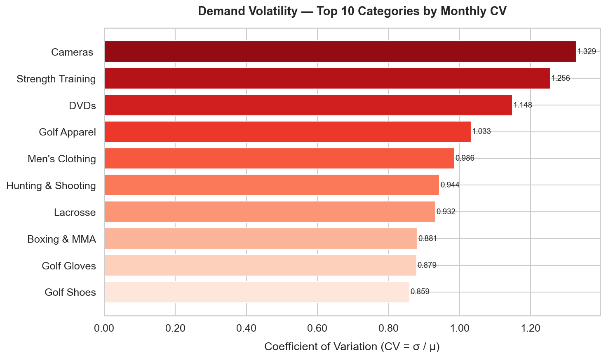

# End-to-End Supply Chain Intelligence: Inventory Optimization & Risk Mitigation
### Transforming Raw ERP Data into Actionable Inventory Policies through Descriptive & Prescriptive Analytics

[](https://www.python.org/)
[](https://www.mysql.com/)
[](https://pandas.pydata.org/)
[](https://seaborn.pydata.org/)
[](https://www.sqlalchemy.org/)

---

## Professional Summary

This system applies **Descriptive and Prescriptive Analytics** to 180,519 real-world supply chain records, addressing two core operational challenges that directly impact a company's bottom line: **Demand Uncertainty** and **Supply Reliability**.

Rather than producing reports for their own sake, each analytical layer feeds a decision: demand volatility analysis drives replenishment strategy selection; supply reliability metrics determine safety stock uplift requirements; the inventory health matrix flags working capital inefficiencies. The output is not a dashboard — it is a set of **inventory policy recommendations** that procurement and operations teams can act on immediately.

**Primary Objective:** Minimize stockout risk while optimizing working capital deployment across the product portfolio.

---

## Core Methodology

### Analytical Framework

The system operates in two analytical modes:

- **Descriptive Analytics (Phase 1):** Quantifies the current state — how volatile is demand? How unreliable is supply? Where is margin being destroyed? These questions produce the risk baseline.
- **Prescriptive Analytics (Phase 2):** Translates that baseline into policy — given measured demand variability and observed lead times, what should the Safety Stock and Reorder Point be for each SKU category?

### Inventory Policy Model

The system implements a **continuous review inventory policy** with statistically derived safety stock targets. The core formula applied in Phase 2:

$$Safety\ Stock = Z \times \sigma_{demand} \times \sqrt{Lead\ Time}$$

| Parameter | Value | Rationale |
|---|---|---|
| $Z$ | **1.645** | Targets a **95% Service Level** — the optimal balance between stockout risk and excess carrying cost for a mid-volatility portfolio |
| $\sigma_{demand}$ | Per-category monthly demand standard deviation, derived from historical order data | |
| $\sqrt{Lead\ Time}$ | Square root of average supplier lead time (days), reflecting how variability compounds over longer replenishment cycles | |

The **Reorder Point (ROP)** is then calculated as:

$$ROP = \overline{d} \times L + Safety\ Stock$$

Where $\overline{d}$ is average daily demand and $L$ is the average lead time in days. This gives procurement teams a precise trigger point to initiate replenishment before a stockout occurs.

---

## Tech Stack

| Layer | Technology | Role |
|---|---|---|
| Data Engineering | SQL · MySQL 8.0 | ETL, KPI aggregations, CTEs, window functions |
| Statistical Modeling | Python · Pandas · NumPy | Demand variability analysis, safety stock calculations |
| Visualization | Matplotlib · Seaborn | Automated BI dashboard generation |
| ORM / DB Interface | SQLAlchemy | Parameterized queries, connection management |
| Dataset | DataCo Smart Supply Chain — 180,519 rows | Source of all transactional demand and logistics data |

---

## System Architecture

```
Raw ERP / CSV Export (180K+ order records)
              │
              ▼
  ┌───────────────────────┐
  │    ingest_data.py     │  ← Standardizes column schema, handles encoding,
  │    (ETL Pipeline)     │    bulk-loads into relational store via SQLAlchemy
  └───────────────────────┘
              │
              ▼
  ┌───────────────────────┐
  │   MySQL Database      │  ← supply_chain_db.orders
  │   (supply_chain_db)   │    Denormalized fact table — single source of truth
  └───────────────────────┘
              │
        ┌─────┴──────┐
        ▼            ▼
  ┌──────────┐  ┌─────────────────────────┐
  │ sql/     │  │   visualize_insights.py │  ← Executes KPI queries, applies
  │ *.sql    │  │   (BI Dashboard Engine) │    statistical models, exports charts
  └──────────┘  └─────────────────────────┘
                            │
                            ▼
              ┌─────────────────────────┐
              │     dashboards/*.png    │  ← Demand Volatility · Supply Reliability
              │     (Policy Outputs)    │    · Inventory Health · ROP Targets
              └─────────────────────────┘
```

---

## Strategic Insights — Dashboard Analysis

### 01 — Demand Volatility: Replenishment Strategy Segmentation



**Executive Summary:**
The Coefficient of Variation ($CV = \sigma / \mu$) is the primary metric for segmenting the product portfolio into replenishment strategies. A high CV indicates that average demand is a poor predictor of future demand — meaning any inventory policy built on simple averages will routinely result in either excess stock or stockouts.

This analysis reveals a clear bifurcation in the portfolio. **Cameras** emerge as the highest-risk category with a CV of **~0.94**, indicating that monthly sales volume is nearly as volatile as the average itself. Categories with $CV > 0.5$ — including Cardio Equipment and Lacrosse — should be migrated away from **Just-in-Time (JIT)** replenishment toward **Buffer Stocking** strategies with elevated safety stock targets. Conversely, low-CV categories are candidates for leaner JIT policies that reduce holding costs without materially increasing stockout risk. This segmentation directly informs the $\sigma_{demand}$ inputs to the Safety Stock formula.

---

### 02 — Supply Reliability: Lead Time Risk & Safety Stock Uplift


**Executive Summary:**
Supply reliability is the second variable in the Safety Stock equation — and this analysis uncovers a critical vulnerability. **Second Class shipping carries a 79.8% late delivery rate** across all completed orders, meaning that for nearly four in five shipments, actual transit time exceeded the scheduled lead time used in procurement planning.

This has a direct and computable impact on inventory policy. When lead time is unreliable, the $\sqrt{Lead\ Time}$ term in the safety stock formula must be adjusted to reflect *actual* lead time variance, not scheduled lead time. Using the planned figure systematically underestimates safety stock requirements for any category routed through Second Class. Operationally, this finding warrants one of two responses: **carrier SLA renegotiation** with updated lead time commitments, or a **modal shift** for high-velocity, high-volatility SKUs to a more reliable shipping tier. Either path reduces the safety stock uplift required to maintain the 95% service level target.

---

### 03 — Inventory Health: Working Capital Efficiency Matrix


**Executive Summary:**
The Sales vs. Profitability scatter matrix surfaces the working capital efficiency profile of every product category simultaneously. The analytical framework maps categories into four strategic quadrants: high-sales/high-margin (core portfolio), high-sales/low-margin (volume traps), low-sales/high-margin (niche value), and low-sales/low-margin (candidates for rationalization).

Categories appearing **at or below the zero-profit line** (red dashed) represent active working capital drains — they consume inventory investment, occupy warehouse space, and generate order fulfillment cost, while returning negligible or negative margin. For a supply chain analyst, these are the first candidates for **SKU rationalization**: reducing order frequency, increasing minimum order quantities, or delisting. Freeing the capital tied to these slow-movers can be redeployed into safety stock for high-CV, high-margin categories where a stockout carries real revenue consequence.

---

### 04 — Reorder Point (ROP) Recommendations *(Phase 2 Output)*

> *Generated by the Phase 2 statistical modeling engine — per-category ROP and Safety Stock targets for procurement.*

The Phase 2 engine applies the Safety Stock formula ($Z = 1.645$, $95\%$ service level) to each product category using:
- **$\sigma_{demand}$** derived from the historical monthly CV analysis (Chart 01)
- **Lead Time** sourced from actual shipping records, adjusted for the reliability discount identified in Chart 02

The output is a procurement-ready table of **Reorder Points and Safety Stock quantities** by category — giving buyers a precise trigger: when on-hand inventory reaches the ROP, replenishment must be initiated. This replaces ad-hoc buyer judgment with a statistically grounded, reproducible policy.

---

## Business Value

| Risk | Before This System | After This System |
|---|---|---|
| **Stockout Risk** | Undifferentiated reorder points based on simple averages | CV-segmented safety stock targets — high-volatility categories carry statistically sufficient buffer |
| **Lead Time Exposure** | Planned lead times used as-is in inventory calculations | Actual lead time variance quantified; safety stock uplifted accordingly for unreliable shipping modes |
| **Working Capital Waste** | No systematic view of margin vs. sales across categories | Low-margin, low-velocity SKUs identified for rationalization; capital redeployed to core portfolio |
| **Inventory Turnover** | Static replenishment cycles across all categories | Differentiated policies (JIT vs. Buffer Stocking) aligned to demand profile, improving turnover on stable SKUs |

---

## How to Run

### Prerequisites

- Python 3.9+
- MySQL 8.0 running locally

```sql
-- Run once in MySQL Workbench or mysql CLI
CREATE DATABASE supply_chain_db;
```

### 1. Install dependencies

```bash
pip install -r requirements.txt
```

### 2. Add the source data

Download the **DataCo Smart Supply Chain** dataset and place it at:

```
data/raw/DataCoSupplyChainDataset.csv
```

### 3. Run the ETL pipeline

```bash
python ingest_data.py
```

Cleans and loads all 180,519 rows into `supply_chain_db.orders`. Expect 1–2 minutes.

### 4. Generate the BI dashboards

```bash
python visualize_insights.py
```

Charts are exported to `dashboards/` on completion with status messages for each stage.

---

## Project Structure

```
Supply-Demand-Analytics/
├── data/
│   └── raw/                         # Source CSV (not tracked in git)
├── dashboards/
│   ├── 01_demand_volatility.png     # CV-based replenishment segmentation
│   ├── 02_supply_reliability.png    # Late delivery rate by shipping mode
│   ├── 03_inventory_health.png      # Sales vs. margin working capital matrix
│   └── 04_rop_recommendations.png  # Per-category ROP & Safety Stock targets (Phase 2)
├── sql/
│   ├── 01_demand_volatility.sql
│   └── 02_supply_reliability.sql
├── notebooks/                       # Exploratory analysis
├── ingest_data.py                   # ETL pipeline
├── visualize_insights.py            # BI dashboard engine
└── requirements.txt
```

---

## Key Findings Summary

| KPI | Quantified Finding | Inventory Policy Implication |
|---|---|---|
| Demand Volatility | Cameras $CV \approx 0.94$ — highest in portfolio | Buffer Stocking mandatory; JIT is inappropriate for this category |
| Supply Reliability | Second Class: **79.8% late delivery rate** | Safety stock uplift required; planned lead time is not a valid input |
| Inventory Health | Multiple high-revenue categories at or below zero-margin | SKU rationalization candidate list generated; capital reallocation opportunity |
| Service Level Target | $Z = 1.645$ ($95\%$ service level) | Balances stockout cost against excess inventory carrying cost |

---

## Roadmap

### Phase 1 — Operational Risk Baseline ✅ *(complete)*
- Automated ETL pipeline (CSV → MySQL)
- SQL-based KPI analytics (Demand Volatility, Supply Reliability, Inventory Health)
- Automated BI dashboards with business insight annotations

### Phase 2 — Prescriptive Inventory Policy *(in progress)*
- **Safety Stock Optimization** — per-category targets using $Z \times \sigma_{demand} \times \sqrt{Lead\ Time}$
- **Reorder Point (ROP) Engine** — procurement-ready trigger table by category
- **Demand Forecasting** — Facebook Prophet / ARIMA for forward-looking $\sigma_{demand}$ estimates

### Phase 3 — Interactive Decision Support *(planned)*
- Streamlit or Tableau dashboard for scenario modeling (e.g., "What happens to ROP if lead time increases 20%?")
- Scheduled pipeline execution with automated policy refresh

---

## Dataset

**DataCo Smart Supply Chain for Big Data Analysis**
Fabian Constante, Fernando Silva, António Pereira — Mendeley Data, 2019.
[https://data.mendeley.com/datasets/8gx2fvg2k6/5](https://data.mendeley.com/datasets/8gx2fvg2k6/5)
